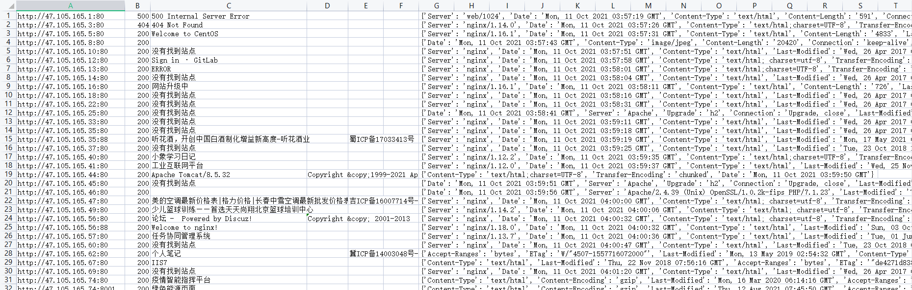

# hosts_scan
带有host碰撞的c段扫描工具；对域名文件进行cdn验证并一键爬取未含cdn的c段主机；


## usage:
```
usage: scan.py [-h] [-i IP | -r IPRANGE | -f IPFILE] [-s SAVEPATH] [-T TIMEOUT] [-t THREADING_COUNT] [-k KEYWORD] [-c COOKIE]

By zongdeiqianxing; Email: jshahjk@163.com

optional arguments:
  -h, --help          show this help message and exit
  -i IP
  -r IPRANGE
  -f IPFILE
  -s SAVEPATH         须给定csv格式
  -T TIMEOUT
  -t THREADING_COUNT
  -k KEYWORD          根据关键词检测响应包内匹配个数
  -c COOKIE
```

## 报告文件
扫描结果将保存为csv文件，内涵发现存活的url, status_code, title, copyright, 备案号, 关键词数量, 响应头等信息；

